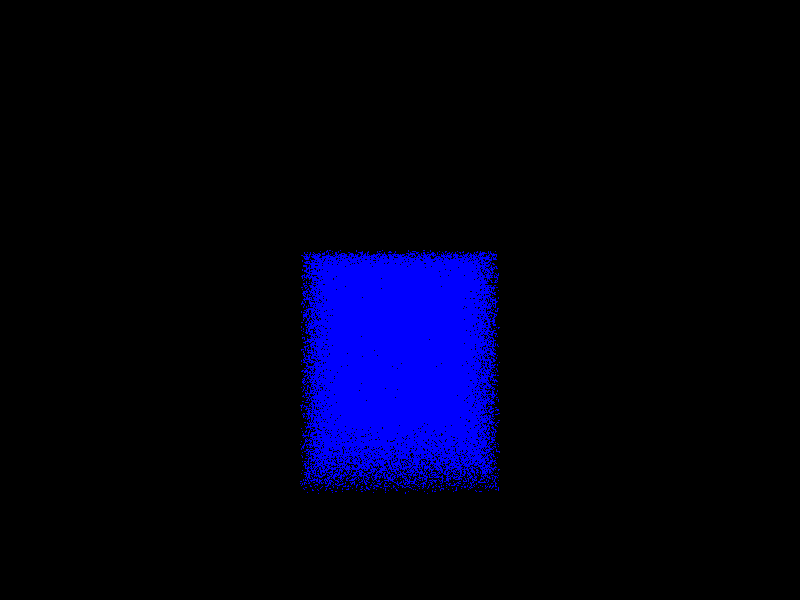
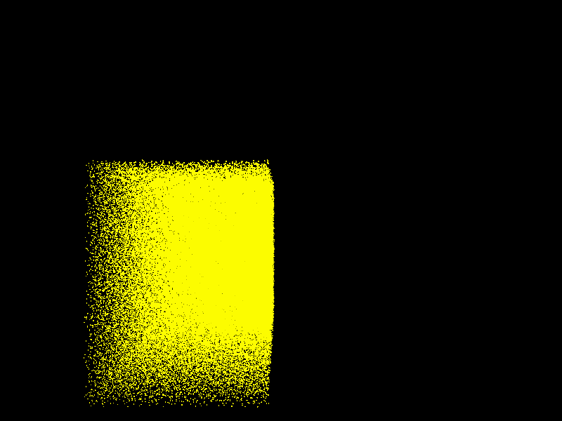

# Animate Sand as a Fluid

Course project for *Physically-Based Simulation in Computer Graphics HS21*, ETH Zurich

*Group 19: Yifan Yu, Bo Li, Yitian Ma*

## Usage
To setup the environment, use
```bash
pip install -r requirements.txt
```

You can change the simulation settings in `src/simulator.py`
```bash
global_params = {
    'mode' : 'apic',                            # pic, apic, flip
    'flip_weight' : 0.99,                       # FLIP * flip_weight + PIC * (1 - flip_weight)
    'dt' : 0.01,                                # Time step
    'g' : (0.0, 0.0, -9.8),                     # Body force
    'rho': 1000.0,                              # Density of the fluid
    'grid_size' : (64, 64, 64),                 # Grid size (integer)
    'cell_extent': 0.1,                         # Extent of a single cell. grid_extent equals to the product of grid_size and cell_extent

    'reconstruct_resolution': (100, 100, 100),  # Mesh surface reconstruction grid resolution
    'reconstruct_threshold' : 0.75,             # Threshold of the metaball scalar fields
    'reconstruct_radius' : 0.1,                 # Radius of the metaball

    'num_jacobi_iter' : 100,                    # Number of iterations for pressure solving using jacobi solver
    'damped_jacobi_weight' : 1.0,               # Damping weighte in damped jacobi

    'simulate_sand': False,                     # Simulate sand or water
    'sand_dt': 0.001,                           # Time step for simulating sand

    'scene_init': 0,                            # Choose from 0, 1, 2 to init the particle positions differently
}
```

The `scene_init` parameter corresponds to: 0 - Centered dam break, 1 - Fall from sky, 2 - Cornered dam break.

Run with GGUI:

```bash
python main.py
```

During running with GUI, you can press `Space` to reconstruct the mesh of current frame and export that into a obj model file. The output will reside in `../results`.

You can also run without GUI and reconstruct each frame:

```bash
python main.py 300
```

where the simulation contains 300 frames.

If the simulation dt is too small, add a second cmdline argument to reconstruct surface every few number of simulation steps:

```bash
python main.py 300 10
```

You can also export frames as PNGs to `output/{method}_{scene_init}/` by changing `OUTPUT` in `src/main.py` to `True`, the default frame number is 300. By default, each frame is acquired per 3 steps of fluid simulation, and 30 steps of sand simulation. The included GIFs in `output-fluid` and `output-sand` is generated by the output PNGs using FFMPEG.

## Dependencies

- taichi==0.9.0
- numpy
- scipy
- PyMCubes
- connected-components-3d

## Presentation & Demo

[Presentation Slides](https://docs.google.com/presentation/d/1zNV_RuGvHOrP2owrsCpm3DUIttuGs6BTQhfzNt_ANrE/edit?usp=sharing)

[Presentation Video](https://drive.google.com/file/d/1rfyft6zG4aZNeOg4XwKlqv4cAfEUGPsb/view?usp=sharing)

## Gallery

### Water

PIC:



FLIP:


APIC:


Rendered:


https://user-images.githubusercontent.com/22713281/154822363-acba1122-e701-4894-b837-5b11e3ff7bc1.mp4


### Sand

PIC:



FLIP:


APIC:


Rendered:

https://user-images.githubusercontent.com/22713281/154822381-9b8196ba-ff78-4e33-a0bb-102fdaee5a13.mp4


